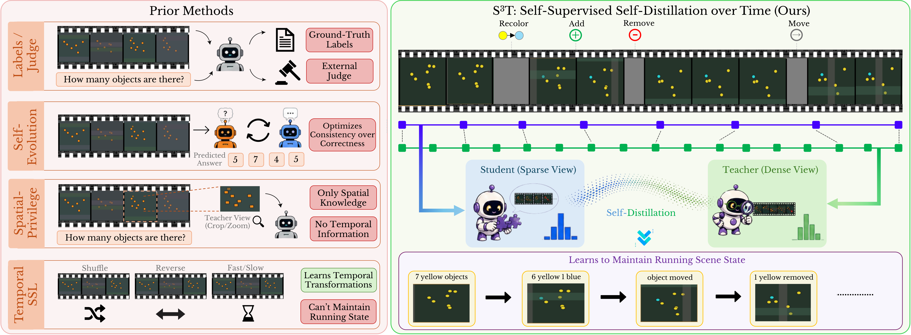

# Temporal Self-Distillation: Learning Visual State Tracking in Videos Without Supervision

Official repository for **S³T: Self-Supervised Self-Distillation over Time**.

[**Shravan Venkatraman**](https://shravfolio.vercel.app/),
[Wenshuai Zhao](https://wenshuaizhao.github.io/),
[Mohammad Hassan Vali](https://research.aalto.fi/en/persons/mohammad-hassan-vali/),
[Arno Solin](https://users.aalto.fi/~asolin/)

ELLIS Institute Finland and Department of Computer Science, Aalto University, Finland  
Mohamed bin Zayed University of Artificial Intelligence, UAE

S³T improves visual state tracking without labels, a separate teacher, or an external reward model. A video-language model reads each training clip at two temporal densities. Its 24-frame view acts as a privileged teacher for the 12-frame student view, while the frozen base model anchors the update. All supervision comes from the student's own generated answer.

## Method

For a fixed state question, the student greedily generates an answer from the sparse view. The student, dense teacher, and adapter-disabled reference then score the same answer token by token. The student LoRA is trained with Jensen-Shannon divergence to follow the teacher while remaining close to the base model.

## Results

VSTAT accuracy (%) over all 1,500 questions. The selected baselines and all S³T variants are taken from Table 1.

| Method | Avg | Count | Location | Attribute | Atomic | Sequence | Set | Dictionary |
|---|---:|---:|---:|---:|---:|---:|---:|---:|
| **Open-source video models** | | | | | | | | |
| LLaVA-OV-2-8B | 35.1 | 28.3 | 43.0 | 40.5 | 33.5 | 38.7 | 46.9 | 27.3 |
| Molmo2-4B | 34.4 | 31.6 | 39.7 | 34.5 | 37.1 | 33.6 | 36.7 | 27.1 |
| Cambrian-S-7B | 34.2 | 33.2 | 33.6 | 36.9 | 34.0 | 30.6 | 40.2 | 32.5 |
| Qwen3-VL-8B | 33.2 | 30.9 | 37.0 | 33.9 | 32.4 | 33.3 | 37.9 | 31.5 |
| **Self-evolving methods** | | | | | | | | |
| Video-Zero-4B† | 31.63 | 27.7 | 34.5 | 36.5 | 32.1 | 32.3 | 37.8 | 25.5 |
| Video-Zero-8B† | 33.89 | 32.0 | 37.2 | 34.3 | 34.1 | 35.5 | 38.3 | 29.1 |
| EvoGround† | 32.66 | 26.7 | 36.6 | 40.6 | 29.7 | 39.5 | 42.9 | 27.0 |
| **Ours** | | | | | | | | |
| LLaVA-OV-2-8B base† | 34.74 | 27.7 | 42.0 | 41.4 | 32.6 | 37.0 | 48.6 | 27.4 |
| S³T (SFT teacher) | 34.45 | 26.0 | 42.2 | 43.6 | 30.9 | 38.0 | 50.9 | 27.5 |
| S³T | 36.48 | 30.4 | 41.7 | 43.3 | 35.2 | 39.4 | 47.8 | 28.8 |
| S³T (soup) | 37.12 | 32.4 | 40.7 | 43.0 | 37.2 | 41.4 | 44.9 | 28.4 |
| **S³T (soup, + vision encoder)** | **37.44** | **32.6** | **42.3** | **42.1** | **37.7** | **42.8** | **45.5** | **27.4** |

† Reproduced under the paper evaluation protocol. All improvements are measured against our reproduced LLaVA-OV-2-8B base.

### Real-video transfer

Change in accuracy (%) over the reproduced base:

| Benchmark | S³T (soup) | S³T (soup, + vision encoder) |
|---|---:|---:|
| VSTAT-YouTube, cumulative-state | +7.35 | **+7.95** |
| MVBench, Action Count | +3.00 | **+4.50** |

## License

The code will be released under the [MIT License](LICENSE). Model adapters will follow the terms of the base model.
